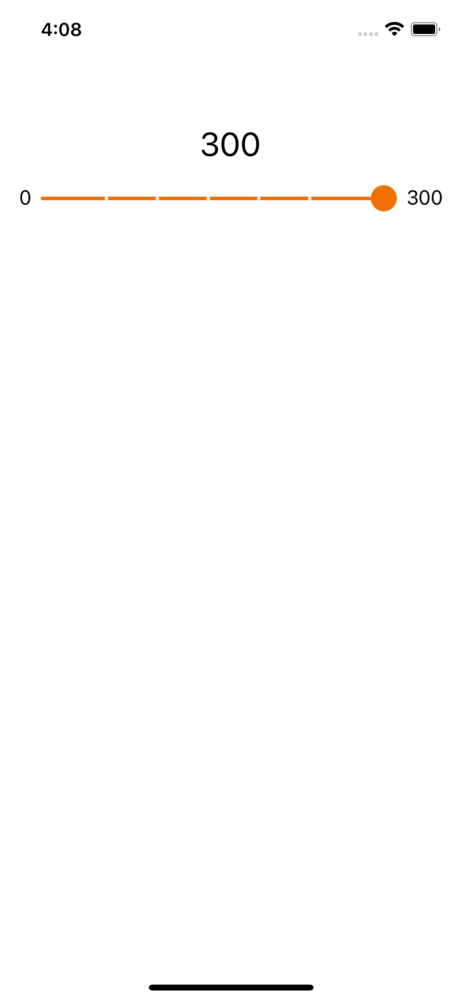

# SlottedSlider

If for some reason you need a swiftUI slider that looks like Andoid slider then this custom component may be useful to you.



###  Installation

1. Using Xcode go to File > Swift Packages > Add Package Dependency
2. Paste the Modele URL:  https://github.com/sarrajbs/SlottedSlider.git
3. Click on next and select the project target

If you have doubts, please, check the following link:
 https://developer.apple.com/documentation/xcode/adding_package_dependencies_to_your_app

After successfully retrieved the package and added it to your project, just import `SlottedSlider` and you can get the full benefits of it.

###  How to use

```swift
 
 import SlottedSlider
 
 let minRange: Double = 0
 let maxRange: Double = 300
 
 @State var sliderValue: Double = 0
 
 @State var displayedValue: Double = 0
 
 var body: some View {
    SlottedSlider(value: $sliderValue,
                  in: minRange...maxRange,
                  slotNumber: 7) { _ in
                    self.displayedValue = self.sliderValue
                }
 }

```
P.S:  
1.  Parameter  `in`: is to specify your wanted range
2.  Parameter `slotNumber` : is the number of displayed steps + 2 (min and max steps)
